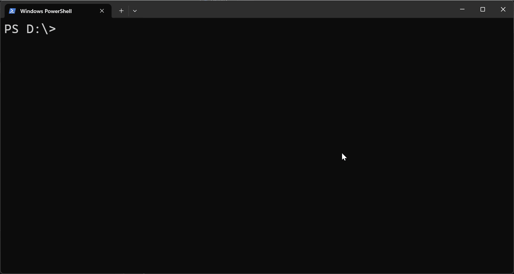

# ctx-launcher (wl) - Named Claude Code setups you can relaunch

[](https://npmjs.com/package/ctx-launcher)
[](https://github.com/fotis89/ctx-launcher/actions/workflows/ci.yml)
[](LICENSE)

> Companion to [Claude Code](https://code.claude.com). Windows x64 prebuilt; macOS/Linux build from source.

Switching between Claude Code projects is slow. Every switch means re-attaching folders, re-explaining context, and often starting a fresh conversation — even if you were in the middle of something yesterday.

`wl` saves each Claude Code setup (repos, folders, instructions, skills) under a name you pick. Switch between them with one command; resume the previous conversation when you want.

Your repo's `CLAUDE.md` stays the team's shared context. `wl` adds your personal layer on top — not committed, not shared.

This is what using `wl` looks like:

## Example

From your project folder:

```bash
cd ~/repos/my-project
wl create my-project
```

Open Claude with that setup from any directory:

```bash
wl launch my-project
```

Come back later and continue the same conversation:

```bash
wl launch my-project --resume
```



## What you can do with it

- Launch Claude with a saved setup by name, from any directory
- Switch between projects without re-explaining context or re-attaching folders
- Come back to a task and pick up where you left off
- Work across multiple repos or folders in one Claude session
- Give Claude notes, instructions, and skills that travel with the workspace, not the repo
- Let Claude create the workspace for you - no JSON to write by hand

## Install (Windows)

Requires Windows x64, [Node.js](https://nodejs.org/), and [Claude Code](https://code.claude.com/docs/en/quickstart#step-1-install-claude-code) on your `PATH`.

```bash
npm install -g ctx-launcher
```

```bash
wl setup
```

`wl setup` installs the Claude Code skills `wl` depends on and prints a tab-completion snippet. Re-run after upgrading.

Verify Claude Code is on `PATH` by running `claude --version` in a new terminal.

## Quick start

1. In the folder you want as Claude's primary working directory:
   ```bash
   cd ~/repos/ctx-launcher
   wl create wl-dev
   ```
   Opens Claude, which suggests a workspace setup for you to approve.

2. Launch the workspace:
   ```bash
   wl launch wl-dev
   ```
   Opens Claude with the workspace's setup — primary repo, attached folders, and instructions. Works from any directory.

3. Come back later and continue the same conversation:
   ```bash
   wl launch wl-dev --resume
   ```
   Same as step 2, but continues the previous conversation instead of starting fresh.

## Commands

| Command | What it does |
| --- | --- |
| `wl create [name]` | Creates a workspace from the current repo (asks Claude to fill it in) |
| `wl launch [name]` | Launches a workspace; omit `name` to use the last one launched |
| `wl launch <name> --resume` | Resumes the previous Claude conversation for that workspace |
| `wl launch <name> --new` | Starts a fresh conversation even if the workspace defaults to resume |
| `wl launch <name> --yolo` | Skips Claude's permission prompts |
| `wl launch <name> -p <name-or-text>` | Starts with a saved prompt, or with raw prompt text |
| `wl list` | Lists all workspaces |
| `wl which <name>` | Shows the exact `claude` command `wl` will run, and checks paths exist |
| `wl edit <name>` | Opens the workspace folder in your system file explorer |
| `wl setup` | Installs Claude Code skills and prints tab-completion setup |

## What's a workspace?

A workspace is a folder at `~/.wl-workspaces/<name>/`, separate from your repos. It holds a saved setup: a primary repo, any additional folders to attach, and optional project-specific instructions.

```text
~/.wl-workspaces/wl-dev/
|-- workspace.json
|-- instructions.md        (optional)
|-- prompts/               (optional)
|   `-- review.md
`-- .claude/               (optional)
    `-- skills/
        `-- wl-review/
            `-- SKILL.md
```

### `workspace.json`

The only required file. It defines the workspace name, the repo Claude starts in, any additional folders to attach, and launch defaults.

```json
{
  "name": "wl dev",
  "primaryRepo": "~/repos/ctx-launcher",
  "additionalDirs": [
    "~/docs/wl-notes"
  ],
  "yolo": false,
  "resume": true
}
```

- `primaryRepo` - Claude's working directory when the session starts
- `additionalDirs` - extra repos or folders attached with `--add-dir`
- `yolo` - default `wl launch` to `--dangerously-skip-permissions`
- `resume` - default `wl launch` to resuming the last conversation

### `instructions.md`

If present, `wl launch` passes this file to Claude with `--append-system-prompt-file`. Use it for notes that don't belong in a repo's `CLAUDE.md`: multi-repo relationships, cross-repo workflows, project-specific context.

### `prompts/*.md`

Reusable launch prompts kept with the workspace.

```md
---
label: Review changes
---
Review the latest changes, summarize the risk, and call out anything that needs manual testing.
```

Launch with the saved prompt:

```bash
wl launch wl-dev -p review
```

Or pass raw text directly:

```bash
wl launch wl-dev -p "investigate the failing test and explain the root cause"
```

### `.claude/skills/`

Claude Code skills that travel with the workspace instead of with the repo's git history. If you don't use Claude Code skills, you can ignore this folder.

## What `wl setup` does

`wl setup` installs two Claude Code skills and prints tab-completion setup.

The skills back the two Claude-driven flows:

- **`/wl-create-workspace`** - used by `wl create`. Inspects the current repo and conversation, proposes a name, the folders to attach, and a draft `instructions.md`, and waits for your approval before writing files. You can also invoke it directly inside any Claude Code session.
- **`/wl-update-workspace`** - run from inside a launched session when the workspace gets out of sync with the repo. It diffs the workspace against the current repo state, proposes updates, and waits for your approval.

Re-run `wl setup` after upgrading `ctx-launcher` so the installed skills stay in sync with the binary.

## Useful details

- `wl which <name>` is the fastest way to confirm path resolution, spot missing attached folders, and inspect the exact `claude ...` command `wl` will run.
- `wl edit <name>` opens the workspace folder so you can tweak `instructions.md`, prompts, or workspace-local skills by hand.

## Build from source

Requires [.NET 10 SDK](https://dotnet.microsoft.com/download).

```bash
git clone https://github.com/fotis89/ctx-launcher.git
cd ctx-launcher
dotnet build wl.slnx --verbosity quiet
dotnet test wl.slnx --verbosity quiet
```

### Publish a native binary

The published npm package is Windows x64 only. If you want to build native binaries yourself:

**Windows** - requires MSVC build tools ([Visual Studio](https://visualstudio.microsoft.com/) C++ workload or standalone [Build Tools](https://visualstudio.microsoft.com/downloads/#build-tools-for-visual-studio-2022)):

```bash
dotnet publish src/wl -c Release -r win-x64
```

**Linux/macOS** - requires `clang` or `gcc`:

```bash
dotnet publish src/wl -c Release -r linux-x64
dotnet publish src/wl -c Release -r osx-x64
dotnet publish src/wl -c Release -r osx-arm64
```

Copy the published binary to a directory on your `PATH`.

## License

[MIT](LICENSE)
